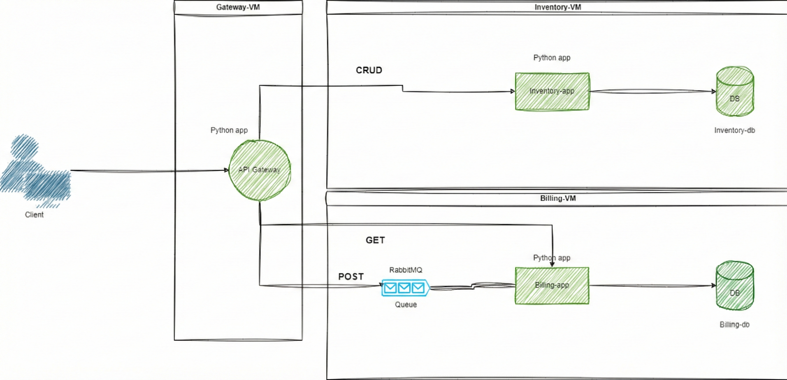

## CRUD Master Py

### Overview



You will set up a movie streaming platform composed of:

- An Inventory API that manages information about available movies.
- A Billing API that processes payments asynchronously.
- An API Gateway that acts as a single entry point for clients.

The API Gateway will communicate with:

- The Inventory API via HTTP
- The Billing API via RabbitMQ

### Learning Objectives

- Design a microservices architecture with an API Gateway and separate services.
- Implement RESTful APIs with PostgreSQL and asynchronous message processing via RabbitMQ.
- Manage Python applications and processes using PM2.
- Document the APIs and project setup clearly for reproducibility.

### Instructions

APIs are a very common and convenient way to deploy services in a modular way.
In this exercise, you will create a simple microservices infrastructure composed
of an API Gateway connected to two services.

One service, the **Inventory API**, retrieves data from a PostgreSQL database.
The other service, the **Billing API**, exclusively processes messages received
through RabbitMQ and does not interact directly with a database via HTTP.

Communication between these services will occur through HTTP and a message
queueing system. Each service will run inside its own virtual machine, ensuring
a clear separation of concerns and responsibilities.

### Required Tools

For this exercise, you will need to install:

- Python 3 (with Flask, SQLAlchemy, and other required packages)
- PostgreSQL
- RabbitMQ
- Postman (or an equivalent API testing tool)
- VirtualBox (or equivalent software such as VMware)
- Vagrant

While this setup may seem overwhelming at first, many resources are available
both on official documentation websites and community blogs.

Configuration details may vary depending on your platform, so feel free to
experiment and ensure that everything is correctly installed before moving on.

#### API 1: Inventory

##### Inventory API

The Inventory API is a RESTful CRUD (Create, Read, Update, Delete) API backed by
a PostgreSQL database.

It provides information about the movies available in the inventory and allows users to do basic operations on it.

A common implementation uses **Flask**, a popular Python web framework, coupled
with **SQLAlchemy**, an ORM that simplifies interactions between the API and the
database.

Here are the endpoints with the possible HTTP requests:

- `/api/movies`: GET, POST, DELETE
- `/api/movies/<id>`: GET, PUT, DELETE

Some details about each one of them:

- `GET /api/movies` retrieve all movies.
- `GET /api/movies?title=[name]` retrieve all movies with `name` in the title.
- `POST /api/movies` create a new movie entry.
- `DELETE /api/movies` delete all movies in the database.

- `GET /api/movies/<id>` retrieve a single movie by `id`.
- `PUT /api/movies/<id>` update a single movie by `id`.
- `DELETE /api/movies/<id>` delete a single movie by `id`.

The Inventory API must be accessible at: `http://localhost:8080/`.

##### PostgreSQL database for Inventory

The API uses a PostgreSQL database named `movies_db`.

The `movies` table must contain the following columns:

- `id`: Auto-generated unique identifier
- `title`: Movie title
- `description`: Movie description

##### Testing the Inventory API

In order to test the correctness of your API you should use Postman or a
similar tool. You have to create one or more tests for every endpoint and then
export the configuration, so you will be able to reproduce the tests on
different machines easily.

> The configuration will be checked during the audit.

You must use Postman or an equivalent tool to test all endpoints.

- Create at least one test for each endpoint
- Export the configuration so it can be reused on other machines

> The exported configuration will be checked during the audit.

#### API 2: Billing

##### Billing API

The Billing API receives messages exclusively through RabbitMQ.

It consumes messages from the `billing_queue`. Each message is a JSON object
encoded as a string, for example:

```json
{
  "user_id": "3",
  "number_of_items": "5",
  "total_amount": "180"
}
```

The Billing API must:

- Parse the received message
- Create a new entry in the `billing_db` database
- Acknowledge the message to RabbitMQ once processed

When the API starts, it must process all pending messages already present in the
queue.

> You may use the `pika` Python library to interface with RabbitMQ.

##### PostgreSQL database for Billing

The Billing API also uses PostgreSQL.

- Database name: `billing_db`
- Table name: `orders`

The `orders` table must contain:

- `id`: Auto-generated unique identifier
- `user_id`: ID of the user placing the order
- `number_of_items`: Number of items ordered
- `total_amount`: Total order cost

##### Testing the Billing API

To test this API here are some steps:

- Publish a message directly to the `billing_queue` using RabbitMQ's UI or CLI
- When the Billing API is running, new entries must appear immediately in the `orders` table
- When the Billing API is stopped, the queries to the API Gateway must still succeed but the `orders` table in the `billing_db` database won't be updated.
- When the Billing API is restarted, the pending messages must be processed and the `orders` table in the `billing_db` database must be updated accordingly.

#### The API Gateway

The API Gateway is responsible for routing requests to the appropriate service
using the correct protocol:

- HTTP for the Inventory API
- RabbitMQ for the Billing API

##### Interfacing with Inventory API

The gateway will route all requests to `/api/movies` at the Inventory API, without any need to check the information passed through it. It will return the exact
response received by the the Inventory API.

##### Interfacing with Billing API

The Gateway must:

- Receive POST requests at `/api/billing`
- Publish the request body as a JSON message to the `billing_queue`
- Accept requests even if the Billing API is not running

Once the Billing API is started, it must process all queued messages and send
acknowledgments.

Example request:

`http://[API_GATEWAY_URL]:[API_GATEWAY_PORT]/api/billing/`:

```json
{
  "user_id": "3",
  "number_of_items": "5",
  "total_amount": "180"
}
```

Upon successful processing, you can expect a response message such as `"Message posted"` or a similar acknowledgment.

> Remember to set up `Content-Type: application/json` for the body of the request.

##### Documenting the API

Good documentation is a very critical feature of every API. By design the APIs
are meant for others to use, so there have been very good efforts to create
standard and easy to implement ways to document it.

As an introduction to the art of great documentation you must create an OpenAPI
documentation file for the API Gateway. There are many different ways to do so,
a good start could be using SwaggerHub with at least a meaningful description
for each endpoint. Feel free to implement any extra feature as you see fit.

> You must also create a `README.md` file at the root of your project with
> detailed instructions on how to build and run your infrastructure and which
> design choices you made to structure it.

#### Virtual Machines

##### General overview

You will use **Vagrant** to create three different VMs in order to
test the interactions and correctness of responses between your APIs
infrastructure.

Vagrant is an open-source software that helps you create and manage virtual
machines. With Vagrant, you can create a development environment that is
identical to your production environment, which makes it easier to develop,
test, and deploy your applications.

Your VMs will be structured as follows:

- `gateway-vm`: This VM will only contain the `api-gateway-app`.
- `inventory-vm`: This VM will contain the `inventory-app` API and the database `movies_db`.
- `billing-vm`: This VM will contain the `billing-app` API, the database `billing_db`, `orders` table and RabbitMQ.

> Vagrant is intended for development environments and must not be used in production.

##### Environment variables

To simplify the building process, it's recommended to define essential variables in a `.env` file. This approach facilitates the modification or update of critical information such as URLs, passwords, usernames and so on.

Consider listing all required environment variables in the README.md file. Once you have these variables identified, create a `.env` file with the necessary credentials.

These variables will be utilized by Vagrant and distributed across the various microservices to centralize the credentials.

Your `.env` file should contain all the necessary credentials and none of the
microservices should have any credential hard-coded in the source code.

> For this project, the `.env` file must be committed to the repository.
> In real-world projects, sensitive data must never be committed.

##### Configuration of the VMs

- You will have a `Vagrantfile` which will create and start the three VMs. It
  will import the environment variables and pass them through each API.
- You will have a `scripts/` directory which will store all the scripts you may
  want to run in order to install the necessary tools on each VM. Those scripts
  may also be very useful for setting up the databases.

Your configuration will work properly for the following commands (executed from
the root of the project):

- `vagrant up`: Starts all the VMs.
- `vagrant status`: Shows the status for all the VMs.
- `vagrant ssh <vm-name>`: Will let you access the VM through SSH.

#### Manage Your Python applications with PM2

PM2 is a process manager commonly used for Node.js applications that makes it easy to manage and monitor running services. It is designed to keep applications running continuously, even in the event of unexpected failures.

Although PM2 is primarily built for Node.js, it can also be used to manage long-running Python processes.

PM2 allows you to start, stop, restart, and list applications, as well as monitor their resource usage and log output. It also provides useful features such as automatic restarts and process resilience.

In this project, PM2 will mainly be used to test the resilience of the system when messages are sent to the Billing API while the service is not running.

After entering in your VM via SSH you may run the following commands:

- `sudo pm2 list`: List all running applications.
- `sudo pm2 stop <app_name>`: Stop a specific application.
- `sudo pm2 start <app_name>`: Start a specific application.

#### Project organization

##### README.md

As a good exercise and a helpful tool it is required for you to deliver a
`README.md` describing the project.

The idea of a `README.md` is to give in few lines enough context about a
project to understand what is it about and how to run it.

This file should include instructions to run and test the project, it should
also give a brief and clear overview of the stack used to build it.

##### Overall file structure

You can organize your internal file structure as you prefer. That said here is
a common way to structure this kind of projects that may help you:

```console
.
├── README.md
├── config.yaml
├── .env
├── scripts
│   └── [...]
├── srcs
│   ├── api-gateway-app
│   │   ├── app
│   │   │   ├── __init__.py
│   │   │   └── ...             // Other python files
│   │   ├── requirements.txt
│   │   └── server.py
│   ├── billing-app
│   │   ├── app
│   │   │   ├── __init__.py
│   │   │   └── ...             // Other python files
│   │   ├── requirements.txt
│   │   └── server.py
│   └── inventory-app
│   │   ├── app
│   │   │   ├── __init__.py
│   │   │   └── ...             // Other python files
│       ├── requirements.txt
│       └── server.py
└── Vagrantfile
```

When testing and before automating it through the VM build you should be able
to start the API Gateway and the two APIs by using the command `python
server.py` inside their respective directories.

As a best practice, each API should use its own Python virtual environment (`venv` or equivalent).

If you choose a different project structure, you must be able to justify it during the audit.

> It is strongly recommended to add `venv/` to your `.gitignore` file to avoid committing generated files.